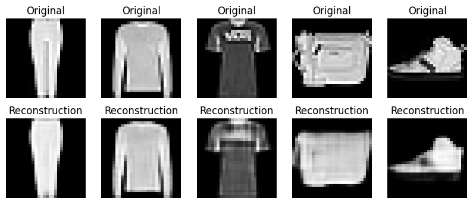
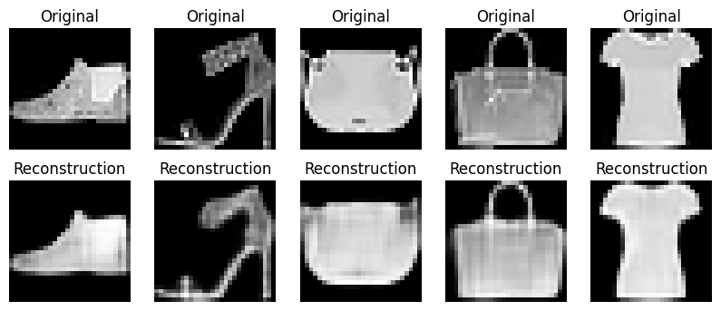
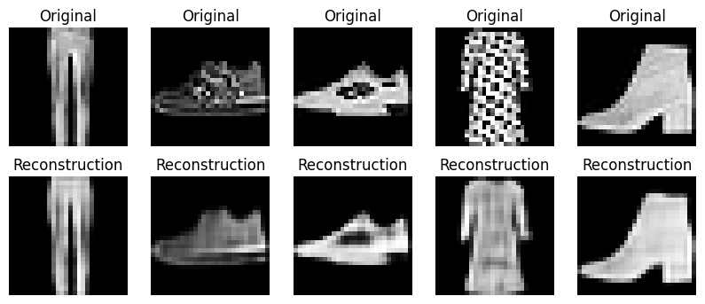
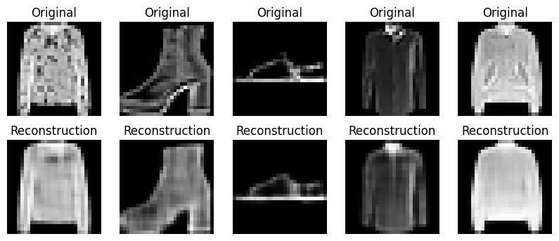
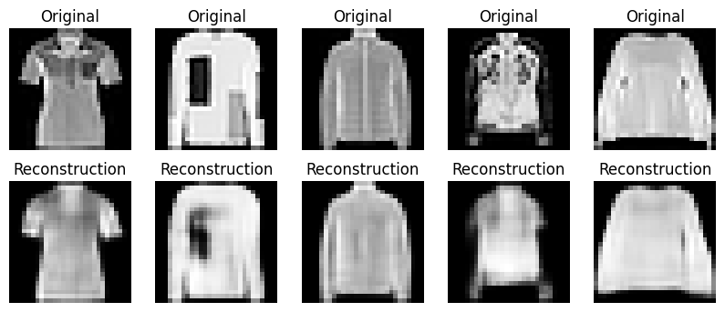
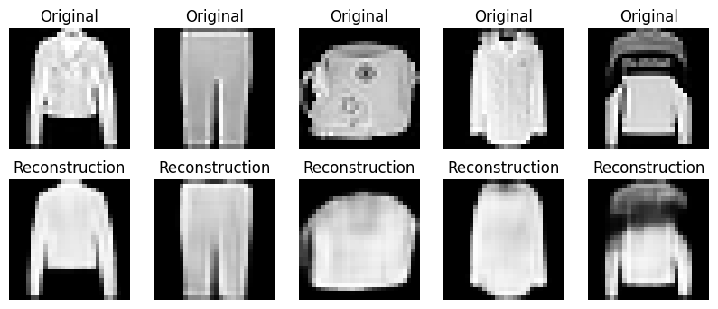
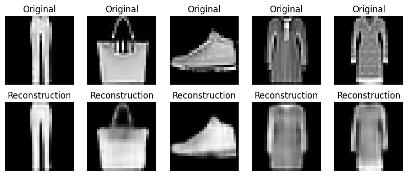
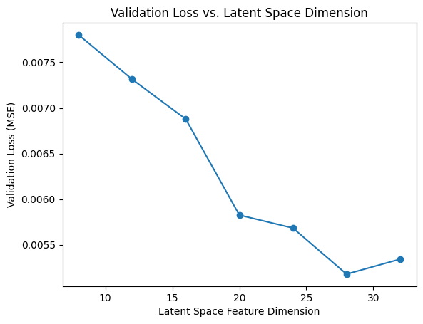
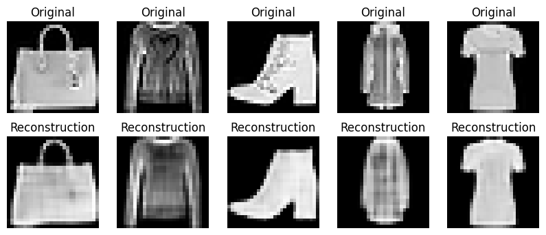

# AI Project 1 Report
## Group 39 - Denis Elshani - Thibaud Despriet

**Question 1** What challenging aspects do you anticipate in this dataset after exploring it?

**Question 2** Which metric did you select for this task, and why?

**Question 3** Based on the training and validation curves from the history plot of your initial model,
what conclusions can you draw?

**Question 4** Which hyperparameters did you optimize? Did you attempt all possible combinations
of parameter values (grid search) or optimize them one at a time? If you tuned the hyperparameters
sequentially, did you select the values to try upfront, or did you base them on the performance of
previous values? Please explain and motivate your strategy.

**Question 5** Did the regularization scheme you tried help? Provide a possible explanation for it.

**Question 6** For how many epochs have you trained the final model? How did you determine the
stopping criterion?

**Question 7** Select a validation sample and show its reconstructions when changing the latent space
sizes. Describe whether and how the reconstruction quality (as you perceive it) decreases with more
compression.

<!-- TODO: Describe -->

**Question 8** Show a few representative examples of test inputs and their reconstructed images.
Comment on the visual quality of the reconstruction of the final autoencoder.

<!-- TODO: Comment -->

