# AI Project 1 Report
## Group 39 - Denis Elshani - Thibaud Despriet

### Building the classifier
---

**Question 1 What challenging aspects do you anticipate in this dataset after exploring it?**

The Fashion MNIST dataset contains classes with similar visual features, such as "Shirt" and "T-shirt/top", which can be challenging for the model to differentiate. Additionally, the used images are very low resolution (28x28 pixels), making it difficult to extract detailed features and patterns. 

**Question 2 Which metric did you select for this task, and why?**

Accuracy was selected as the evaluation metric because the dataset is balanced across all classes, making accuracy a suitable measure of overall model performance.

**Question 3 Based on the training and validation curves from the history plot of your initial model,
what conclusions can you draw?**

The training and validation curves show that the model's accuracy improves over epochs with overfitting. In the first epochs of training, the model quickly learns to classify the data, as indicated by the steep increase in accuracy. However, the validation accuracy lags behind the training accuracy, suggesting that the model may be overfitting to the training data. The gap between the training and validation accuracy curves indicates that the model could benefit from regularization and early stopping techniques to prevent overfitting and improve generalization.
 

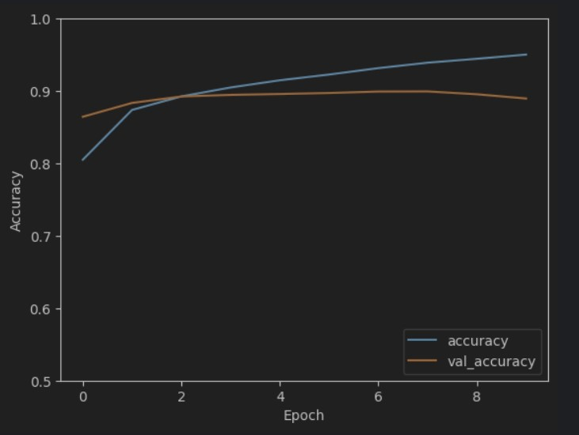 
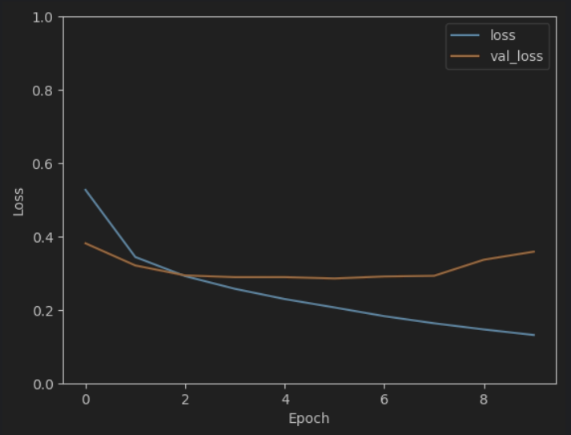 

**Question 4 Which hyperparameters did you optimize? Did you attempt all possible combinations
of parameter values (grid search) or optimize them one at a time? If you tuned the hyperparameters
sequentially, did you select the values to try upfront, or did you base them on the performance of
previous values? Please explain and motivate your strategy.**

We decided to optimize three hyperparameters: batch size, amount of filters in the model and the learning rate. To start we used a grid search for the batch size and learning rate, here we could see that the batch size used did not really affect accuracy. We then choose the batch size with the highest accuracy (relative did not change one percent), and performed another grid search using the number of filters in the convolutional layers. This trend can be continued to optimize other hyperparameters further, this results in less models needed to be trained instead of one big multidimentional grid search over all the hyperparameters.

**Question 5 Did the regularization scheme you tried help? Provide a possible explanation for it.**

Implementing dropout regularization helped reduce overfitting by randomly deactivating neurons during training. This prevented the model from becoming too dependent on specific neurons, improving its ability to generalize to new data.
Other regularization techniques were not tested because of time reasons.

**Question 6 For how many epochs have you trained the final model? How did you determine the
stopping criterion?**

The final model was trained for 8 epochs. While tuning the hyperparameters we saw that the model started to overfit when reaching 8 epochs. So now we set the epoch size to 8 when training the final model to prevent overfitting, as we cannot monitor the validation loss anymore.

### Encoding the dataset
---

**Question 7 Select a validation sample and show its reconstructions when changing the latent space
sizes. Describe whether and how the reconstruction quality (as you perceive it) decreases with more
compression.**

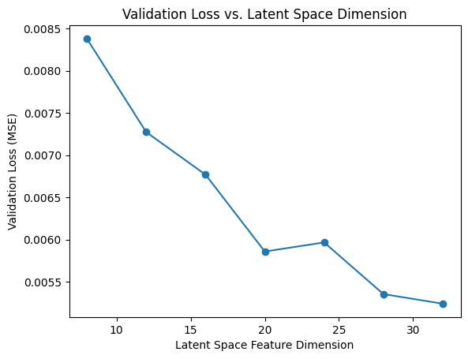

Latent space 32 
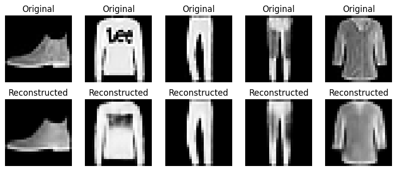 
Latent space 28 
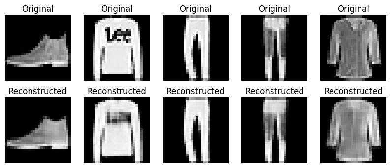 
Latent space 24 
 
Latent space 20 
 
Latent space 16 
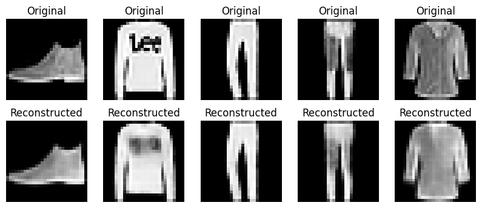 
Latent space 12 
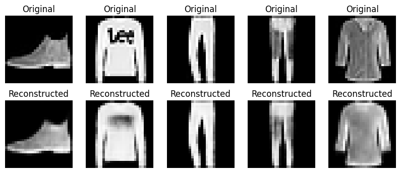 
Latent space 8 
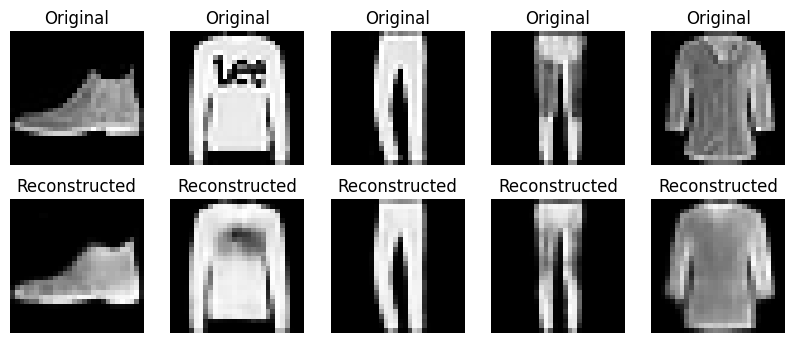

As the latent space size decreases, the reconstruction quality diminishes noticeably. With larger latent space dimensions (e.g., 32), the autoencoder retains more detailed features of the original images, resulting in clearer and more accurate reconstructions. However, as the latent space is compressed to smaller dimensions like 16, 12, and down to 8, the reconstructions become progressively blurrier and lose finer details. This happens because a smaller latent space cannot capture all the essential information from the original data, leading to a loss of important features during the encoding process. Consequently, the autoencoder's ability to accurately reconstruct the original input deteriorates with increased compression.

**Question 8 Show a few representative examples of test inputs and their reconstructed images.
Comment on the visual quality of the reconstruction of the final autoencoder.**

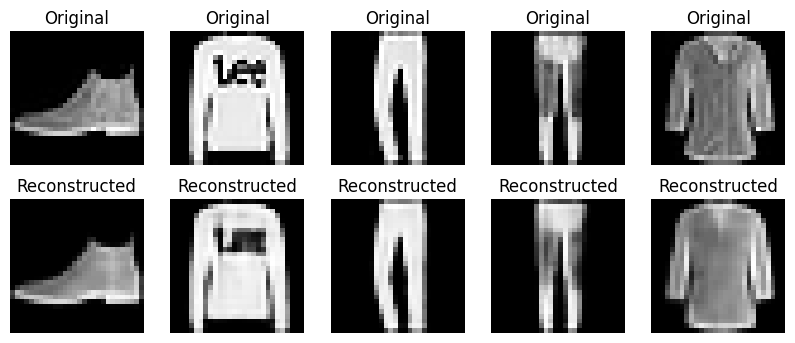

The reconstructed images maintain the overall structure and shape of the original inputs. Key features, such as the silhouette and primary distinguishing traits of the objects (e.g., bag handles, shoe outlines, and garment shapes), are well preserved. However, the reconstructions appear slightly blurred and lack finer details, suggesting that the autoencoder prioritizes capturing broad patterns over intricate textures. This indicates the model is effective in learning a compact representation of the input but struggles to perfectly replicate high-frequency details.

### Explaining the classifier
---

**Question 9 Considering the sources of misclassification, along with the performance of your model
on the training test dataset, explain the limitations of your model regarding data quality, overfitting,
and underfitting. Select four examples of misclassification that highlight these underlying issues and
plot them. Use local examples and counterexamples to illustrate your reasoning.**

The biggest source for misclassification is overlapping labels, when plotting the test images with their local (counter)examples we see that the test image almost always resembles the (counter)examples. because of the small resolution (28x28), it is often difficult to differentiate between the small nuances of the labels. Another reason is noise, because of the low resolution of the images, it is sometimes difficult to see what the image represent, even as a human observer. The final big reason of misclassification is underfitting, in the history of training we saw that the model overfitted rapidly in the increasing amount of epochs, for that reason we decide to train the final model for only 8 epochs, which apperently in the end meant that the model is slightly underfitting. As this only happens a small portion of the time we cannot say we have an underfitting model, but the overlapping labels is the biggest reason for misclassification. 

Overlapping labels
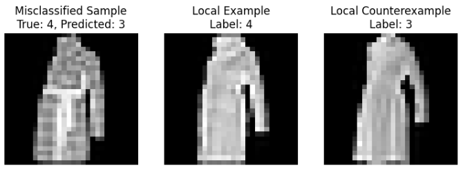 
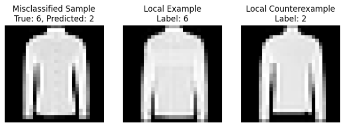 
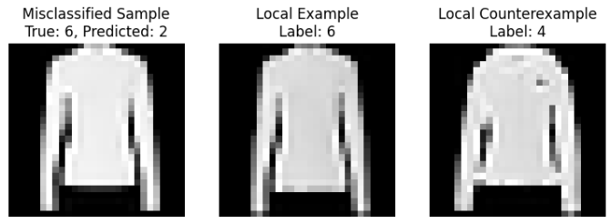 
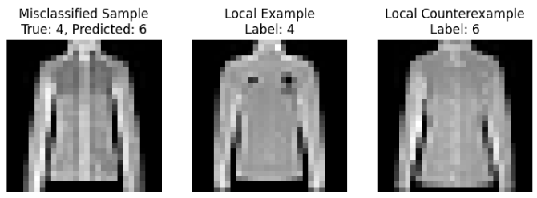 

Underfitting
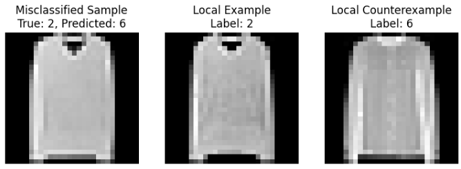 
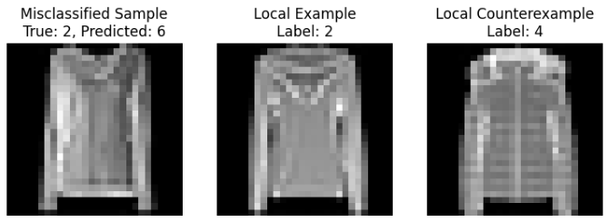 

Noise
 
 

### Use of generative AI and collaboration within the group

**Use of generative AI**

We occasionally utilized generative AI tools to assist with coding and debugging tasks. These tools provided helpful code suggestions and aided in resolving specific issues we encountered. While not a central part of our workflow, the AI assistance contributed to improving our efficiency in certain areas of the project.

**Collaboration and task distribution within the group**

Our collaboration was effective and well-organized. At the beginning of the project, Denis focused on building the classifier, while Thibaud worked on the autoencoder independently. After completing our respective tasks, we shared our findings and discussed the results to gain a comprehensive understanding of each component. We then worked together to explain the classifier, ensuring alignment on the project's objectives and outcomes. Before submitting the project, we jointly reviewed all aspects to verify correctness and enhance the overall quality, making necessary adjustments to improve our final submission.